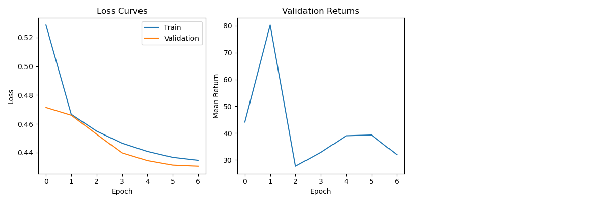
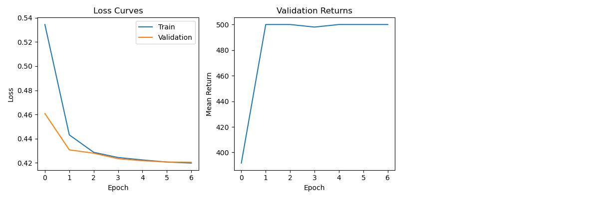
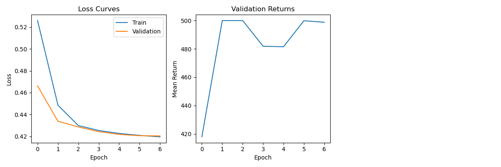
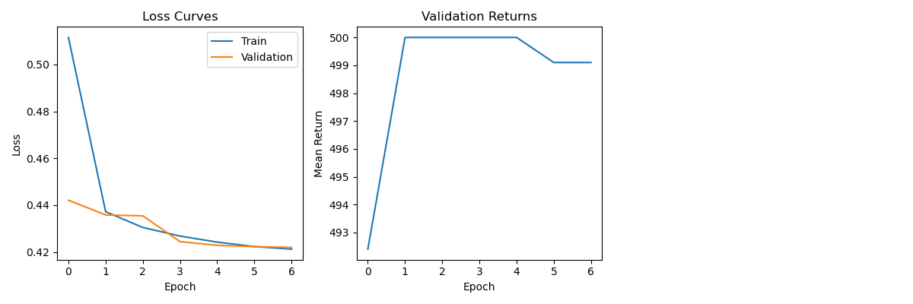

https://github.com/AlisherBlack/Decision-Transformer-with-Memory-for-POMDPs

Статистика датасета:

| parameter | value |
|---|---:|
| total samples | 45718 |
| train samples | 41146 |
| validation samples | 4572 |
| state dim | 2 |
| actions | 2 |

Параметры запуска:

```text
env = velocity_cartpole
epochs = 7
eval episodes = 20
context length = 20
```

Базовое сравнение:

| model | final eval mean return | success rate | best validation return |
|---|---:|---:|---:|
| DT | 38.15 | 0% | 80.30 |
| DT + GRU | 500.00 | 100% | 500.00 |
| DT + LSTM | 490.75 | 95% | 500.00 |

Графики обучения:

DT



DT + GRU



DT + LSTM



Обычный DT без памяти (`context_length = 20`) не смог решить задачу. Train/validation loss снижался, но качество в среде осталось низким.

GRU оказалась лучшей из базовых memory-моделей: mean return 500, success rate 100%.

Текущий вывод: для `VelocityCartPoleEnv` явная память сильно улучшает качество Decision Transformer. Я связываю это с тем, что среда частично наблюдаемая: скорости скрыты, и их нужно восстанавливать по истории.


**RTG ablation**

Проверил уже обученную `DT + GRU` модель с разными `target_return`.

| target return | eval mean return | success rate |
|---:|---:|---:|
| 100 | 106.60 | 0% |
| 300 | 306.75 | 0% |
| 500 | 500.00 | 100% |
| 700 | 500.00 | 100% |

`target_return` реально влияет на поведение модели. Если попросить return около 100 или 300, модель примерно столько и набирает. Если попросить 500, она решает задачу полностью.

`target_return > 500` здесь не имеет смысла, потому что в `CartPole-v1` максимум равен 500 шагам.


**Context length ablation**

Проверил разные окна для `DT + GRU`.

| context length | final eval mean return | success rate | best validation return |
|---:|---:|---:|---:|
| 5 | 412.45 | 30% | 500.00 |
| 20 | 500.00 | 100% | 500.00 |
| 50 | 405.00 | 40% | 471.40 |

Лучший результат получился при `context_length = 20`.

Окно `context_length = 5` иногда решает задачу, но нестабильно. Видимо, истории из 5 шагов часто недостаточно, чтобы устойчиво восстановить скрытые скорости.

Окно `context_length = 50` тоже не улучшило качество. Возможно, для такого большого окна нужно больше данных или больше обучения.

По этим экспериментам основной вариант — `context_length = 20`.


**Custom memory**

Гипотеза: можно отказаться от сложной GRU/LSTM памяти и получить качество не сильно хуже.

Для этого был добавлен механизм `delta_gated`.

Идея: в `VelocityCartPoleEnv` скрыты скорости, но их можно примерно восстановить из разности соседних наблюдений. Поэтому memory-модуль использует текущий `state_embedding` и изменение embedding относительно предыдущего шага.

```text
delta_t = state_embedding_t - state_embedding_{t-1}
[state_embedding_t, delta_t] -> MLP -> memory_embedding
```

Дальше `memory_embedding` добавляется к `state_embedding`.

В этом механизме нет рекуррентности.

Результат:

| model | final eval mean return | success rate | best validation return |
|---|---:|---:|---:|
| DT + DeltaGated | 500.00 | 100% | 500.00 |

График обучения:



DeltaGated сходится быстро: уже на первой эпохе validation return был 492.40, а со второй эпохи модель вышла на 500.

Гипотеза подтвердилась. Для этой задачи необязательно использовать сложную recurrent memory: простой механизм с разностью соседних observation embeddings тоже решает задачу на 100%.

Но это скорее особенность именно `VelocityCartPoleEnv`: здесь скрытые переменные похожи на скорости, а скорости хорошо приближаются через разности соседних состояний.


**Финальный вывод**

Обычный DT с окном 20 не смог решить задачу, хотя теоретически истории должно хватать для восстановления скоростей.

GRU, LSTM и DeltaGated сильно улучшают качество. Лучшие результаты у GRU и DeltaGated:

| model | eval mean return | success rate |
|---|---:|---:|
| DT + GRU | 500.00 | 100% |
| DT + DeltaGated | 500.00 | 100% |

Основной вывод: в этой POMDP-задаче важно не просто иметь историю в контексте, а явно доставать из неё скрытую динамику. GRU делает это через recurrent state, DeltaGated — через разность соседних observation embeddings.
